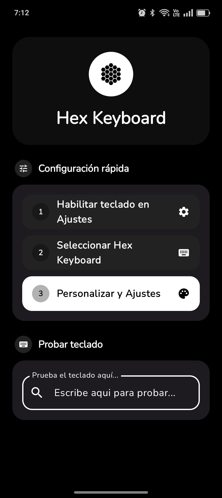
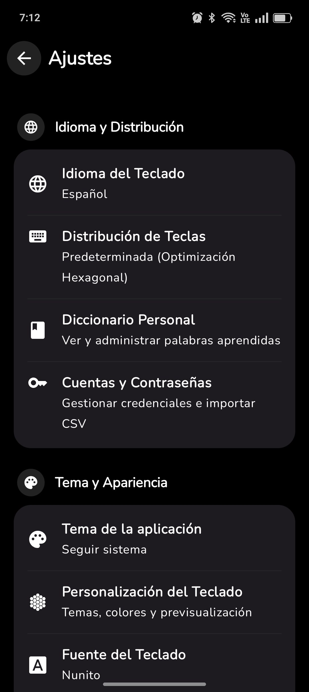
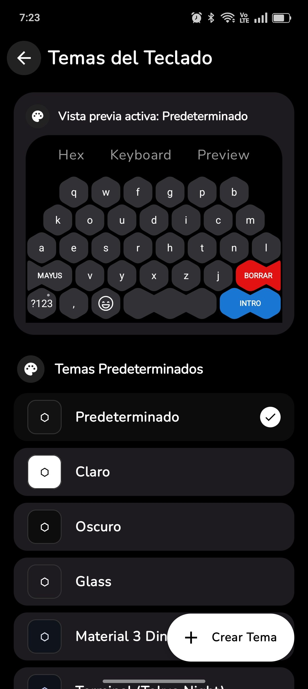
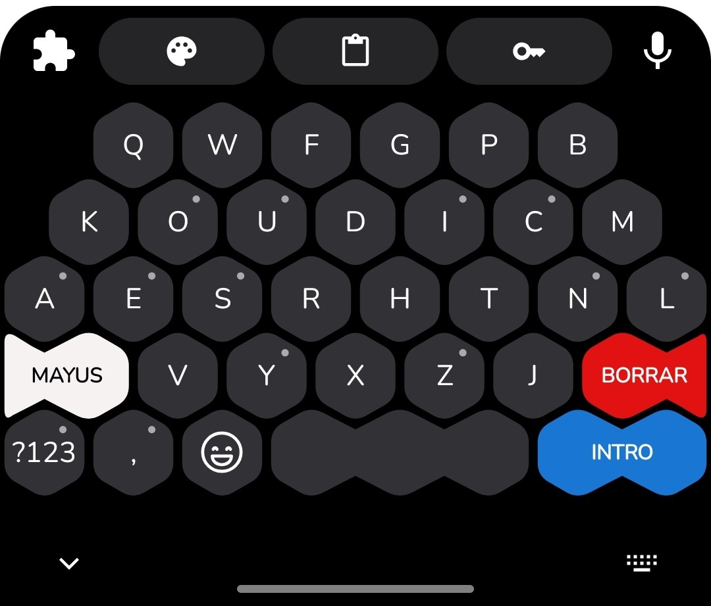
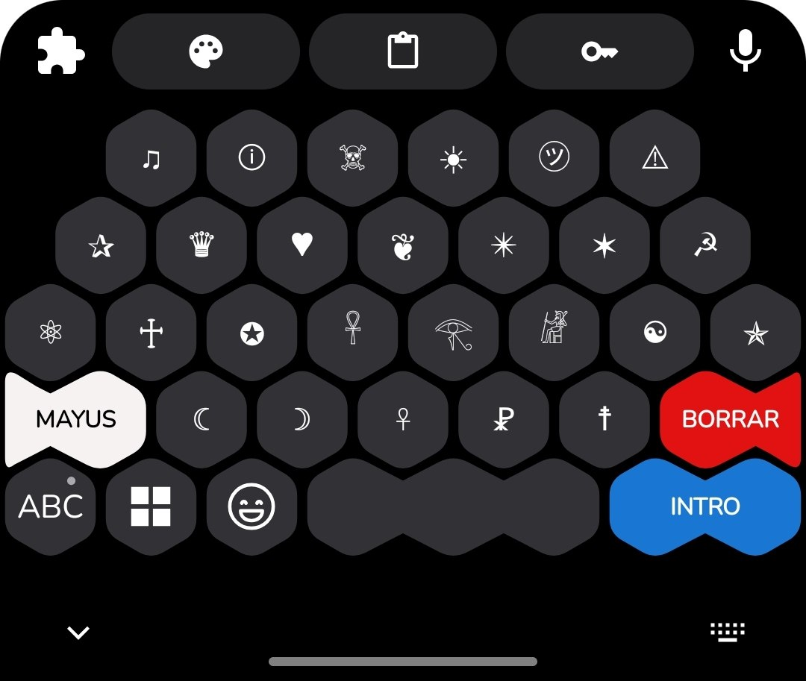
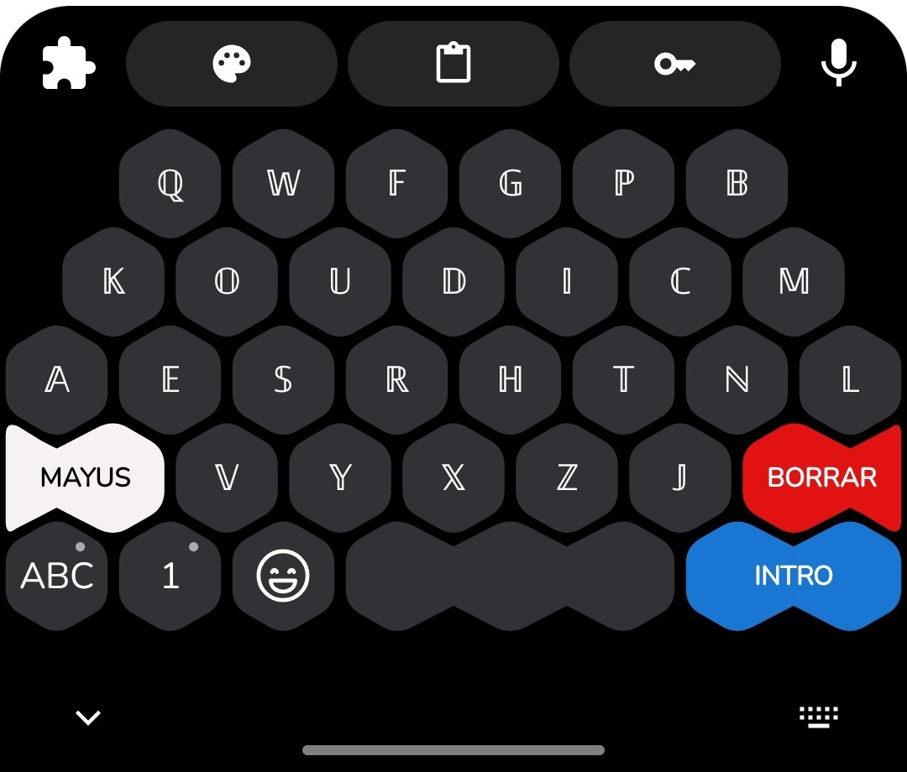
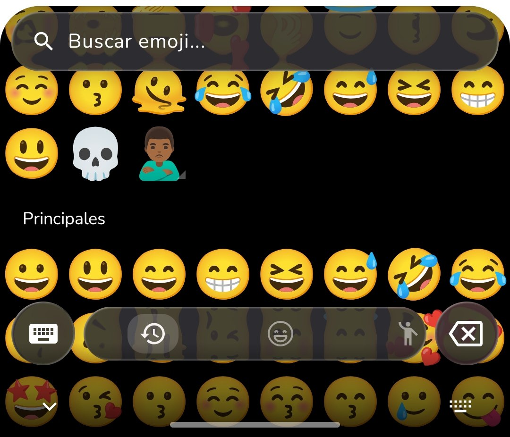

<p align="center">
  
</p>

<h1 align="center">HexKeyboard</h1>

<p align="center">
  Teclado virtual nativo para Android con disposición hexagonal ergonómica, procesamiento local de texto y personalización avanzada.
</p>

<p align="center">
  <a href="https://github.com/migueljesuszc28/hexkeyboard/releases/latest">
    
  </a>
  
  
  
  
</p>

---

## Capturas de Pantalla

<p align="center">
  

  

  

  

  

  
  &nbsp;&nbsp;&nbsp;&nbsp;
  
  &nbsp;&nbsp;&nbsp;&nbsp;
</p>

---

## Características Principales

- **Distribución Hexagonal Ergonómica:** Diseño geométrico optimizado para la escritura con pulgares, reduciendo errores de pulsación accidentales.
- **Desarrollado en Jetpack Compose:** Interfaz nativa, fluida y reactiva integrada mediante interoperabilidad con `InputMethodService`.
- **Privacidad Local sin Conexión:** Procesamiento de texto, predicciones y aprendizaje de palabras realizado estrictamente en el dispositivo, sin telemetría ni acceso a red.
- **Motor de Predicción y Sugerencias:** Sugerencias contextuales de alta velocidad y soporte de autocorrección local.
- **Panel de Emojis Integrado:** Navegación por categorías, variantes de tono de piel y gestión de emojis frecuentes.
- **Gestión de Credenciales y Portapapeles:** Historial local seguro y autocompletado de datos frecuentes.
- **Personalización de Temas:** Soporte para modo claro, oscuro, efectos translúcidos (Liquid Glass) y fuentes personalizadas.

---

## Descarga e Instalación

Puedes descargar el archivo APK ejecutable de la versión más reciente desde la sección de lanzamientos del repositorio:

[Descargar APK (Última versión)](https://github.com/migueljesuszc28/hexkeyboard/releases/latest)

### Configuración en el dispositivo:
1. Instala el archivo `HexKeyboard.apk` en tu dispositivo Android.
2. Abre **Ajustes** > **Sistema** > **Idiomas e introducción de texto** > **Teclado en pantalla**.
3. Activa **HexKeyboard** en la lista de teclados disponibles.
4. Selecciónalo como método de entrada predeterminado.

---

## Requisitos del Sistema

- **Lenguaje:** Kotlin
- **Toolkit UI:** Jetpack Compose (Material 3)
- **Versión mínima:** Android 8.0 (API Nivel 26)
- **Versión objetivo:** Android 14+ (API Nivel 34)
- **Sistema de construcción:** Gradle con Kotlin DSL (`build.gradle.kts`)

---

## Compilación del Proyecto

Para clonar y compilar el proyecto localmente utilizando Android Studio o la consola:

```bash
# Clonar el repositorio
git clone https://github.com/migueljesuszc28/hexkeyboard.git

# Acceder al directorio del proyecto
cd hexkeyboard

# Compilar el archivo APK de depuración
./gradlew assembleDebug
```

---

## Licencia

Este proyecto está bajo la Licencia MIT. Consulta el archivo `LICENSE` para obtener más información.
